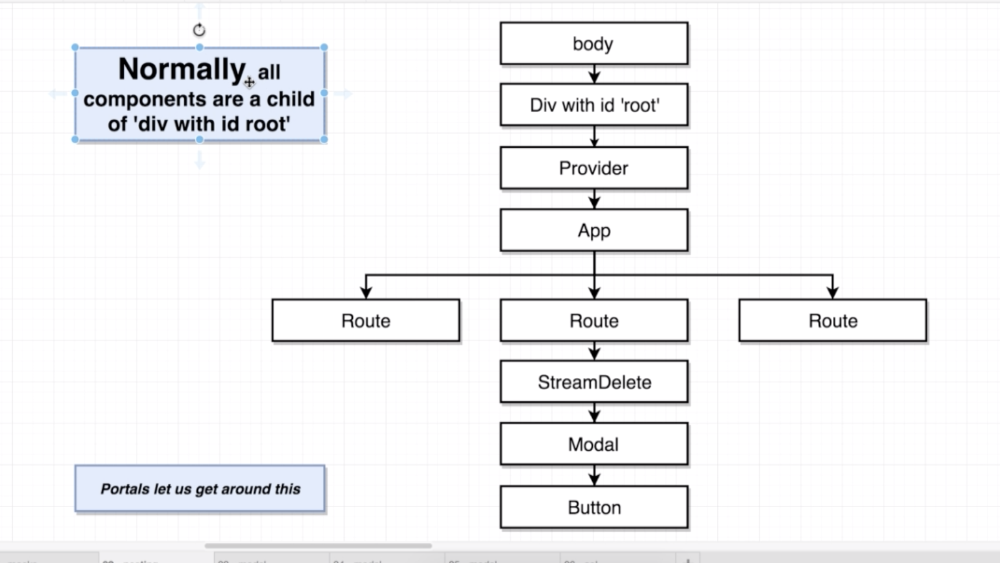
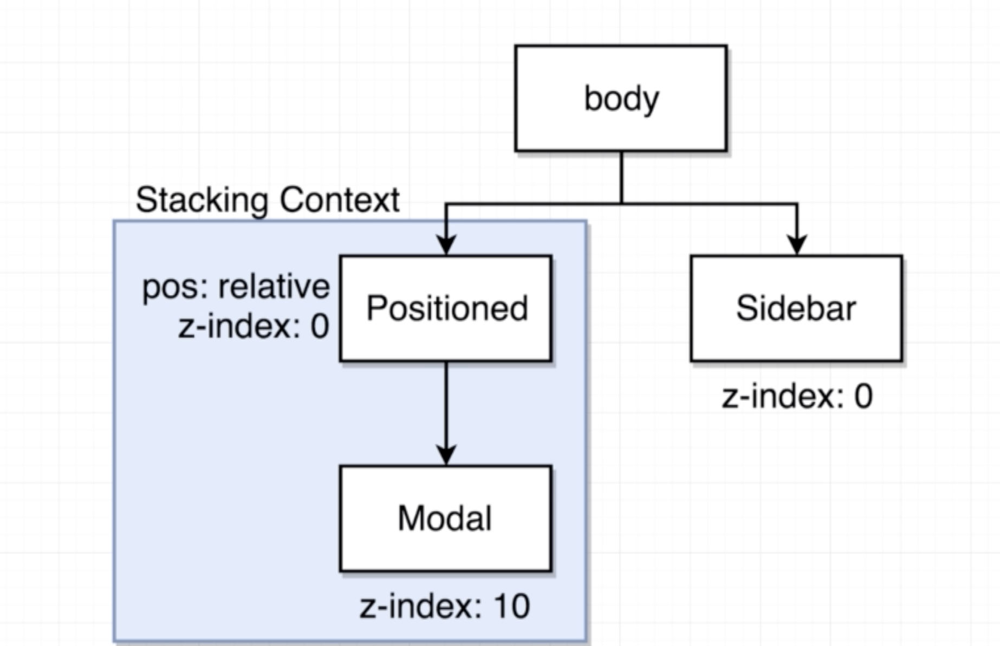
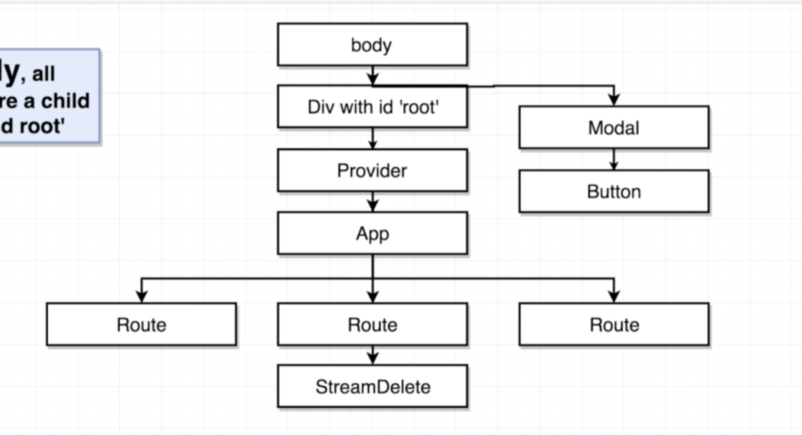

- 모든 리액트 컴포넌트는 `#root` element 안에 render 됨.
- Portals 는 리액트 프로젝트에서 컴포넌트를 렌더링하게 될 때, Component 를 어디에 렌더링 시킬지 DOM 을 사전에 선택하여 부모 컴포넌트의 바깥에 렌더링 할 수 있게 해주는 기능입니다.

- `.sidebar` 랑 `.modal` 이랑 비교하는데, stacking context 의 root element 인 `.positioned` 와 비교
- `.sidebar` 가 나중에 불려지기 때문에 display on the top
- default z-index 는 0이다.

